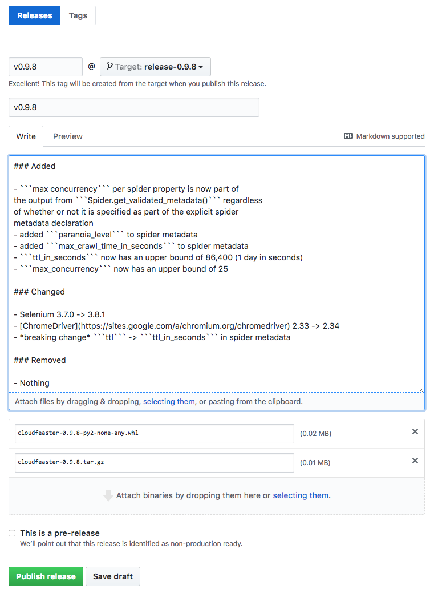

# Contributing

The following instructions describe how you can contribute
to this project.

## Getting Started

See [this](../dev_env) for details of how to configure a development environment
and get the automated tests working.

## Branching and Versioning Strategy

* all development is done on the ```master``` branch
* we use [Semantic Versioning](http://semver.org/)
* for each release a new branch is created from master called ```release-<version>```

## How To Cut a Release

* this process leverages all the good work in the [simonsdave / dev-env](https://github.com/simonsdave/dev-env) project
* the shell script ```prep-for-release-python.sh``` automates much of the release process
* make sure your ```~/.pypirc``` is setup

```bash
(env) ~/cloudfeaster> pip install ndg-httpsclient
```

```bash
(env) ~/cloudfeaster> prep-for-release-python.sh
Already on 'master'
Your branch is up-to-date with 'origin/master'.
diff --git a/CHANGELOG.md b/CHANGELOG.md
index c9ba91b..bcff583 100644
--- a/CHANGELOG.md
+++ b/CHANGELOG.md
@@ -3,7 +3,7 @@ All notable changes to this project will be documented in this file.
 Format of this file follows [these](http://keepachangelog.com/) guidelines.
 This project adheres to [Semantic Versioning](http://semver.org/).

-## [%RELEASE_VERSION%] - [%RELEASE_DATE%]
+## [0.9.8] - [2018-01-10]

 ### Added

These changes to master for release look ok? (y/n)> y
[master 86c678f] 0.9.8 pre-release prep
 1 file changed, 1 insertion(+), 1 deletion(-)
diff --git a/CHANGELOG.md b/CHANGELOG.md
index bcff583..bca58a5 100644
--- a/CHANGELOG.md
+++ b/CHANGELOG.md
@@ -3,6 +3,20 @@ All notable changes to this project will be documented in this file.
 Format of this file follows [these](http://keepachangelog.com/) guidelines.
 This project adheres to [Semantic Versioning](http://semver.org/).

+## [%RELEASE_VERSION%] - [%RELEASE_DATE%]
+
+### Added
+
+- Nothing
+
+### Changed
+
+- Nothing
+
+### Removed
+
+- Nothing
+
 ## [0.9.8] - [2018-01-10]

 ### Added
diff --git a/cloudfeaster/__init__.py b/cloudfeaster/__init__.py
index 17ea304..9d1bb72 100644
--- a/cloudfeaster/__init__.py
+++ b/cloudfeaster/__init__.py
@@ -1 +1 @@
-__version__ = '0.9.8'
+__version__ = '0.10.0'
These changes to master for next release look ok? (y/n)> y
```

```bash
[master 5f4bfa0] Prep CHANGELOG.md for next release
 2 files changed, 15 insertions(+), 1 deletion(-)
Switched to branch 'release-0.9.8'
running bdist_wheel
running build
running build_py
creating build
creating build/lib.linux-x86_64-2.7
creating build/lib.linux-x86_64-2.7/cloudfeaster
copying cloudfeaster/spider.py -> build/lib.linux-x86_64-2.7/cloudfeaster
copying cloudfeaster/webdriver_spider.py -> build/lib.linux-x86_64-2.7/cloudfeaster
copying cloudfeaster/__init__.py -> build/lib.linux-x86_64-2.7/cloudfeaster
creating build/lib.linux-x86_64-2.7/cloudfeaster/samples
copying cloudfeaster/samples/bank_of_canada_daily_exchange_rates.py -> build/lib.linux-x86_64-2.7/cloudfeaster/samples
copying cloudfeaster/samples/pypi_spider.py -> build/lib.linux-x86_64-2.7/cloudfeaster/samples
copying cloudfeaster/samples/__init__.py -> build/lib.linux-x86_64-2.7/cloudfeaster/samples
running egg_info
writing requirements to cloudfeaster.egg-info/requires.txt
writing cloudfeaster.egg-info/PKG-INFO
writing top-level names to cloudfeaster.egg-info/top_level.txt
writing dependency_links to cloudfeaster.egg-info/dependency_links.txt
reading manifest file 'cloudfeaster.egg-info/SOURCES.txt'
reading manifest template 'MANIFEST.in'
writing manifest file 'cloudfeaster.egg-info/SOURCES.txt'
creating build/lib.linux-x86_64-2.7/cloudfeaster/jsonschemas
copying cloudfeaster/jsonschemas/spider_metadata.json -> build/lib.linux-x86_64-2.7/cloudfeaster/jsonschemas
running build_scripts
creating build/scripts-2.7
copying and adjusting bin/spiderhost.py -> build/scripts-2.7
copying and adjusting bin/spiders.py -> build/scripts-2.7
changing mode of build/scripts-2.7/spiderhost.py from 664 to 775
changing mode of build/scripts-2.7/spiders.py from 664 to 775
installing to build/bdist.linux-x86_64/wheel
running install
running install_lib
creating build/bdist.linux-x86_64
creating build/bdist.linux-x86_64/wheel
creating build/bdist.linux-x86_64/wheel/cloudfeaster
creating build/bdist.linux-x86_64/wheel/cloudfeaster/jsonschemas
copying build/lib.linux-x86_64-2.7/cloudfeaster/jsonschemas/spider_metadata.json -> build/bdist.linux-x86_64/wheel/cloudfeaster/jsonschemas
copying build/lib.linux-x86_64-2.7/cloudfeaster/spider.py -> build/bdist.linux-x86_64/wheel/cloudfeaster
creating build/bdist.linux-x86_64/wheel/cloudfeaster/samples
copying build/lib.linux-x86_64-2.7/cloudfeaster/samples/bank_of_canada_daily_exchange_rates.py -> build/bdist.linux-x86_64/wheel/cloudfeaster/samples
copying build/lib.linux-x86_64-2.7/cloudfeaster/samples/pypi_spider.py -> build/bdist.linux-x86_64/wheel/cloudfeaster/samples
copying build/lib.linux-x86_64-2.7/cloudfeaster/samples/__init__.py -> build/bdist.linux-x86_64/wheel/cloudfeaster/samples
copying build/lib.linux-x86_64-2.7/cloudfeaster/webdriver_spider.py -> build/bdist.linux-x86_64/wheel/cloudfeaster
copying build/lib.linux-x86_64-2.7/cloudfeaster/__init__.py -> build/bdist.linux-x86_64/wheel/cloudfeaster
running install_egg_info
Copying cloudfeaster.egg-info to build/bdist.linux-x86_64/wheel/cloudfeaster-0.9.8-py2.7.egg-info
running install_scripts
creating build/bdist.linux-x86_64/wheel/cloudfeaster-0.9.8.data
creating build/bdist.linux-x86_64/wheel/cloudfeaster-0.9.8.data/scripts
copying build/scripts-2.7/spiderhost.py -> build/bdist.linux-x86_64/wheel/cloudfeaster-0.9.8.data/scripts
copying build/scripts-2.7/spiders.py -> build/bdist.linux-x86_64/wheel/cloudfeaster-0.9.8.data/scripts
changing mode of build/bdist.linux-x86_64/wheel/cloudfeaster-0.9.8.data/scripts/spiderhost.py to 775
changing mode of build/bdist.linux-x86_64/wheel/cloudfeaster-0.9.8.data/scripts/spiders.py to 775
creating build/bdist.linux-x86_64/wheel/cloudfeaster-0.9.8.dist-info/WHEEL
creating '/home/vagrant/cloudfeaster/dist/cloudfeaster-0.9.8-py2-none-any.whl' and adding '.' to it
adding 'cloudfeaster/__init__.py'
adding 'cloudfeaster/spider.py'
adding 'cloudfeaster/webdriver_spider.py'
adding 'cloudfeaster/jsonschemas/spider_metadata.json'
adding 'cloudfeaster/samples/__init__.py'
adding 'cloudfeaster/samples/bank_of_canada_daily_exchange_rates.py'
adding 'cloudfeaster/samples/pypi_spider.py'
adding 'cloudfeaster-0.9.8.data/scripts/spiderhost.py'
adding 'cloudfeaster-0.9.8.data/scripts/spiders.py'
adding 'cloudfeaster-0.9.8.dist-info/DESCRIPTION.rst'
adding 'cloudfeaster-0.9.8.dist-info/metadata.json'
adding 'cloudfeaster-0.9.8.dist-info/top_level.txt'
adding 'cloudfeaster-0.9.8.dist-info/WHEEL'
adding 'cloudfeaster-0.9.8.dist-info/METADATA'
adding 'cloudfeaster-0.9.8.dist-info/RECORD'
running sdist
running check
creating cloudfeaster-0.9.8
creating cloudfeaster-0.9.8/bin
creating cloudfeaster-0.9.8/cloudfeaster
creating cloudfeaster-0.9.8/cloudfeaster.egg-info
creating cloudfeaster-0.9.8/cloudfeaster/jsonschemas
creating cloudfeaster-0.9.8/cloudfeaster/samples
copying files to cloudfeaster-0.9.8...
copying MANIFEST.in -> cloudfeaster-0.9.8
copying README.md -> cloudfeaster-0.9.8
copying README.rst -> cloudfeaster-0.9.8
copying setup.cfg -> cloudfeaster-0.9.8
copying setup.py -> cloudfeaster-0.9.8
copying bin/spiderhost.py -> cloudfeaster-0.9.8/bin
copying bin/spiders.py -> cloudfeaster-0.9.8/bin
copying cloudfeaster/__init__.py -> cloudfeaster-0.9.8/cloudfeaster
copying cloudfeaster/spider.py -> cloudfeaster-0.9.8/cloudfeaster
copying cloudfeaster/webdriver_spider.py -> cloudfeaster-0.9.8/cloudfeaster
copying cloudfeaster.egg-info/PKG-INFO -> cloudfeaster-0.9.8/cloudfeaster.egg-info
copying cloudfeaster.egg-info/SOURCES.txt -> cloudfeaster-0.9.8/cloudfeaster.egg-info
copying cloudfeaster.egg-info/dependency_links.txt -> cloudfeaster-0.9.8/cloudfeaster.egg-info
copying cloudfeaster.egg-info/requires.txt -> cloudfeaster-0.9.8/cloudfeaster.egg-info
copying cloudfeaster.egg-info/top_level.txt -> cloudfeaster-0.9.8/cloudfeaster.egg-info
copying cloudfeaster/jsonschemas/spider_metadata.json -> cloudfeaster-0.9.8/cloudfeaster/jsonschemas
copying cloudfeaster/samples/__init__.py -> cloudfeaster-0.9.8/cloudfeaster/samples
copying cloudfeaster/samples/bank_of_canada_daily_exchange_rates.py -> cloudfeaster-0.9.8/cloudfeaster/samples
copying cloudfeaster/samples/pypi_spider.py -> cloudfeaster-0.9.8/cloudfeaster/samples
Writing cloudfeaster-0.9.8/setup.cfg
Creating tar archive
removing 'cloudfeaster-0.9.8' (and everything under it)
diff --git a/README.md b/README.md
index 8dd0476..765d372 100644
--- a/README.md
+++ b/README.md
@@ -4,8 +4,8 @@
 
 
 [](https://pypi.python
-[](https
+[
 [ is the story behind Cloudfeaster.
+[This](https://github.com/simonsdave/cloudfeaster/tree/release-0.9.8/docs/story.md) is t

 ## What Next

-* see [these](docs/contributing.md) instructions
+* see [these](https://github.com/simonsdave/cloudfeaster/tree/release-0.9.8/docs/contrib
 describe how to setup your development environment and
 start contributing to Cloudfeaster
-* [this](docs/spider_authors.md) describes
+* [this](https://github.com/simonsdave/cloudfeaster/tree/release-0.9.8/docs/spider_autho
 how to author spiders using Cloudfeaster
These changes to release-0.9.8 look ok? (y/n)> y
```

```bash
[release-0.9.8 1ce22be] 0.9.8 release prep
 1 file changed, 5 insertions(+), 5 deletions(-)
All changes made locally. Ok to push changes to github? (y/n)> y
```

```bash
Switched to branch 'master'
Your branch is ahead of 'origin/master' by 2 commits.
  (use "git push" to publish your local commits)
Counting objects: 48, done.
Compressing objects: 100% (7/7), done.
Writing objects: 100% (8/8), 724 bytes | 0 bytes/s, done.
Total 8 (delta 5), reused 1 (delta 0)
remote: Resolving deltas: 100% (5/5), completed with 3 local objects.
To git@github.com:simonsdave/cloudfeaster.git
   ba0a381..5f4bfa0  master -> master
Switched to branch 'release-0.9.8'
Counting objects: 21, done.
Compressing objects: 100% (3/3), done.
Writing objects: 100% (3/3), 386 bytes | 0 bytes/s, done.
Total 3 (delta 2), reused 0 (delta 0)
remote: Resolving deltas: 100% (2/2), completed with 2 local objects.
To git@github.com:simonsdave/cloudfeaster.git
 * [new branch]      release-0.9.8 -> release-0.9.8
Switched to branch 'master'
Your branch is up-to-date with 'origin/master'.
(env) ~/cloudfeaster>
```

```bash
(env) ~/cloudfeaster> twine upload dist/* -r testpypi
Uploading distributions to https://test.pypi.org/legacy/
Uploading cloudfeaster-0.9.8-py2-none-any.whl
Uploading cloudfeaster-0.9.8.tar.gz
(env) ~/cloudfeaster>
```

Now look on [https://test.pypi.org/project/cloudfeaster/](https://test.pypi.org/project/cloudfeaster/)
to confirm all is ok and if it is upload to the test version of pypi.

```bash
(env) ~/cloudfeaster> twine upload dist/*
Uploading distributions to https://upload.pypi.org/legacy/
Uploading cloudfeaster-0.9.8-py2-none-any.whl
Uploading cloudfeaster-0.9.8.tar.gz
(env) ~/cloudfeaster>
```

Now look on [https://pypi.org/project/cloudfeaster/](https://pypi.org/project/cloudfeaster/)
to confirm all is ok and if it is upload to the production version of pypi.

```bash
(env) ~/cloudfeaster> cd dist/
(env) ~/cloudfeaster/dist> cp * /vagrant/.
(env) ~/cloudfeaster/dist> ls -la /vagrant/cloudfeaster*
-rw-r--r-- 1 vagrant vagrant 18987 Jan 10 14:19 /vagrant/cloudfeaster-0.9.8-py2-none-any.whl
-rw-r--r-- 1 vagrant vagrant 15642 Jan 10 14:19 /vagrant/cloudfeaster-0.9.8.tar.gz
(env) ~/cloudfeaster>
```

* on the [releases](https://github.com/simonsdave/cloudfeaster/releases)
page hit the <Draft a new release> button in the upper right corner
* fill out the release form as per the screenshot below
* main body of the form can be pulled directly from [CHANGELOG.md](../CHANGELOG.md)
* don't forget to attach to the release the ```cloudfeaster-*.whl``` and ```cloudfeaster-*.tar.gz```
copied to ```/vagrant``` in one of the above steps


