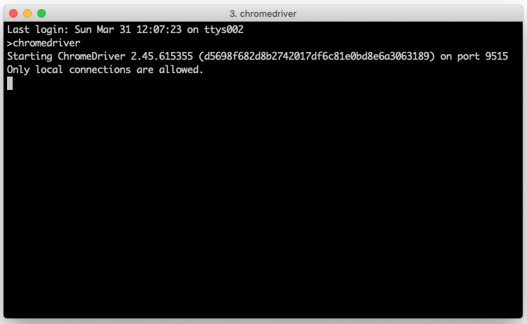
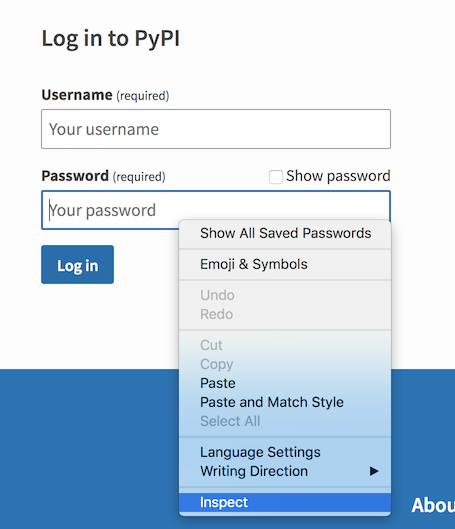
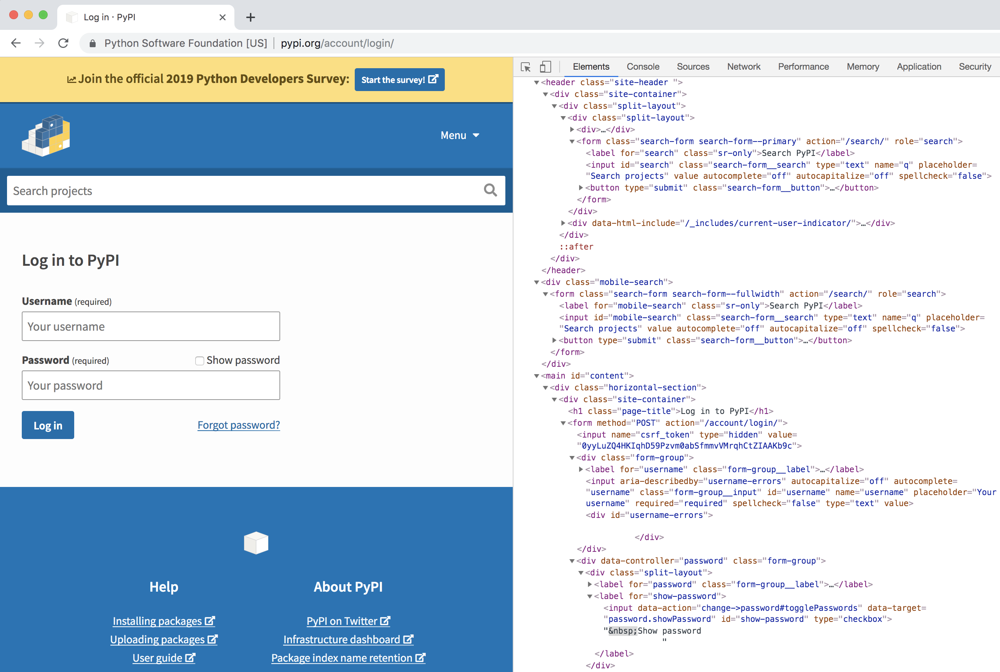
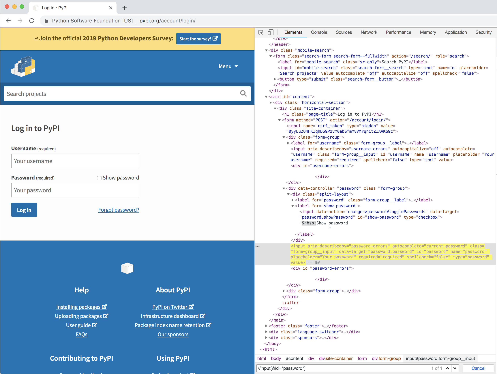

# Spider Authors

## Skills

What skills do I need to author spiders?
In general, the ideal spider author is someone that's automated
website testing using [Selenium 2.0](http://www.seleniumhq.org/projects/webdriver/). More specifically, a spider author should:

1. get how websites are built and how to test them using automated tools
1. understand the fundamentals of object oriented Python 2.7.x,
   [JSON](http://www.json.org),
   [Selenium WebDriver](http://www.seleniumhq.org/projects/webdriver/) and
   probably [XPath](http://en.wikipedia.org/wiki/XPath)

## Getting Started

Let's begin with an overview of the spider development process.
In this documentation we'll use [this repo](https://github.com/simonsdave/gaming-spiders)
and [these spiders](https://github.com/simonsdave/gaming-spiders) as examples.
Embedded in this documentation is a healthy dose of best practice
and required practice and best efforts will be made to note the difference.

* create a repo on [github](https://github.com)
* setup the repo to produce a Python distribution with a distribution name
  ending in ```-spiders``` (this naming convention is a required practice because
  it's relied upon by Cloudfeaster during spider discovery)
* connect the repo to [CircelCI](https://circleci.com) and use [```generate-circleci-config.py```](../bin/generate-circleci-config.py)
  to generate the required/recommended [CircelCI configuration](https://circleci.com/docs/2.0/configuration-reference/)

## Branching and Versioning Strategy

* the master branch ... :TODO: [protected branch](https://help.github.com/en/articles/about-protected-branches)
* all development is done on topic branches created from the master branch
* :TODO: [pull request](https://help.github.com/articles/using-pull-requests/)
* use [Semantic Versioning](http://semver.org/)
* for each release a new branch is created from master called ```release-<version>```
* :TODO: use ```cut-release.sh``` to create a release

## Collaboration

The following outlines the recommended best practice for
how a (small) group of spiders authors can collaborate on authoring
a collection of spiders

* teams of spider authors use
  the [collaborative development model](https://help.github.com/en/articles/about-collaborative-development-models)
  collaboration model
* spider authors work in topic branches
* once the spider author is happy with the changes they
  create a [pull request](https://help.github.com/articles/using-pull-requests/)
  into the master branch from the topic branch
* use [semantic commit messages](https://seesparkbox.com/foundry/semantic_commit_messages)
* per [this article](https://thoughtbot.com/blog/better-commit-messages-with-a-gitmessage-template) ```~/.gitconfig``` should look something like
  below - in particular note ```template```

```ini
[user]
name = Dave Simons
email = simonsdave@gmail.com
[commit]
template = ~/.gitmessage
```

* ```~/.gitmessage``` is referenced by ```template``` above

```text
# feat: add hat wobble
# ^--^  ^------------^
# |     |
# |     +-> Summary in present tense.
# |
# +-------> Type: chore, docs, feat, fix, refactor, style, or test.
#
# chore: add Oyster build script
# docs: explain hat wobble
# feat: add beta sequence
# fix: remove broken confirmation message
# refactor: share logic between 4d3d3d3 and flarhgunnstow
# style: convert tabs to spaces
# test: ensure Tayne retains clothing
```

## Overview of a Spider's Structure

* best practice recommends creating one spider per ```.py``` file
* each spider is a Python class derived from ```cloudfeaster.spider.Spider```
* spiders define metadata which describes the website to be scraped and the required crawl arguments
* crawl arguments are referred to as factors because
  they are typically identifying and authenticating factors used by the spider to login
  to a website on behalf of a user
* metadata is expressed in a JSON document and is validated
  against [this](../cloudfeaster/jsonschemas/spider_metadata.json)
  [jsonschema](http://json-schema.org/)
* the metadata's JSON document is returned by a class method of
  the spider called ```get_metadata()```
* spiders are required to supply a single ```crawl()``` method which has
  2 + number of factors arguments
* the body of the ```crawl()``` method is where the spider author
  writes a [Selenium WebDriver](http://www.seleniumhq.org/projects/webdriver/) script
* Cloudfeaster spiders adapt well to changing websites and variable
  networks - [this](https://selenium-python.readthedocs.io/waits.html)
  describes Selenium explicit and implicit waits - Cloudfeaster supports both
  implicit and explicit waits however using explicit waits is recommended because
  it results in spiders with better resiliency characteristics -
  [25 Jan '17 - Best Practice: Use Explicit Waits](https://wiki.saucelabs.com/display/DOCS/Best+Practice%3A+Use+Explicit+Waits)
  is a good article on explicit waits

First a spider with no factors.

```python
:TODO: fill me in
```

Now a spider with factors.

```python
:TODO: fill me in
```

## Metadata

* :TODO: fill me in

### Categories

A spider's fully qualified name will be something like gaming_spiders.miniclip.Spider
so in this case the class name is Spider, module name is miniclip and the package
name is gaming_spiders.

Spiders are grouped into categories.
A spider can appear in more than one category.
A spider's categories are declared as part of the spider's metadata.
If no categories are declared in a spider's metadata then the
spider's package name (per the above) is used as the spider's
category. One caveat, by convention, package names often end
with _spiders. When a category name is generated from a spider's
package name, the trailing _spiders is removed from the package name.

```python
class MySpider(spider.Spider):

    @classmethod
    def get_metadata(self):
        return {
            'categories': [
                'one',
                'two',
                'three',
            ],
            'url': 'https://example.com',
        }
```

### TTL

* Cloudfeaster caches crawl results
  for the time specified by the ```ttl``` property of a
  spider's metadata.
* ```60s``` is the default value for ```ttl``` meaning that cloudfeaster
  caches crawl results for 60 seconds
* ```ttl``` is a string property of the form ```<number><duration>```
  where ```<number>``` is an non-zero integer and ```<duration>``` is one
  of ```s```, ```m```, ```h``` or ```d``` representing seconds, minutes, hours
  and days respectively

```python
class MySpider(spider.Spider):

    @classmethod
    def get_metadata(self):
        return {
            'url': 'https://example.com',
            'ttl': '1h',
        }
```

### Paranoia Level

* some web site owners do not like spiders crawling their web sites
  and put in place mechanisms to defend against crawling
* Cloudfeaster uses various approaches for circumventing these defenses
* over time these defenses will evolve
* spider authors can optionally add a ```paranoiaLevel``` property
  to a spider's metadata to describe how serious a web site owner is
  about defending against crawling
* ```low``` is the default value for ```paranoiaLevel``` with ```medium```
  and ```high``` being the other permissible values
* based on the ```paranoiaLevel```, Cloudfeater will select appropriate
  circumventing approach with ```low``` meaning Cloudfeaster does nothing
* one word of caution - spider authors should expect that setting ```paranoiaLevel```
  to ```high``` will cause a spider to run slower and cost more to run that setting ```paranoiaLevel```
  to  ```low```

```python
class MySpider(spider.Spider):

    @classmethod
    def get_metadata(self):
        return {
            'url': 'https://example.com',
            'paranoiaLevel': 'low',
        }
```

### Maximum Crawl Concurrency

* spider authors can optionally define the spider metadata property ```maxConcurrentCrawls```
  which defines the maximum number of spiders which can be concurrently crawling
  a web site - this concurrency level is enforced by the Cloudfeaster infrastructure
* 3 is the default value for ```maxConcurrentCrawls``` and 1 and 25 are the
  minimum and maximum values respectively
* motivation for setting an upper bound on the number of concurrent crawls is
  exactly the same as ```paranoiaLevel``` = some website owners are very sensitive
  to spiders crawling their websites

```python
class MySpider(spider.Spider):

    @classmethod
    def get_metadata(self):
        return {
            'url': 'https://example.com',
            'maxConcurrentCrawls': 5,
        }
```

### Maximum Crawl Time

* by defining ```maxCrawlTime``` spider authors can
  declare the maximum time needed for a spider crawl to a website
* ```30s``` is the default value for ```maxCrawlTime```
* ```maxCrawlTime``` is a string property of the form ```<number><duration>```
  where ```<number>``` is a non-zero integer and ```<duration>``` is one
  of ```s``` or ```m``` representing seconds and minutes respectively

```python
class MySpider(spider.Spider):

    @classmethod
    def get_metadata(self):
        return {
            'url': 'https://example.com',
            'maxCrawlTime': '45s',
        }
```

### Identifying and Authenticating Factors

* when your spider needs to login to a website on behalf of a user, the username
  and password for the user needs to be available to the spider at crawl time
  but should not be hard coded into the spider
* naming convention
  * identifying factors (ex username) are used to identify a user
  * authenticating factors (ex password) are used to verify (authenticate) a user's identity
* why differentiate between identifying and authenticating factors? if you're building
  a UI that dynamically adapts to available spiders you're going to want to know when
  a factor is, for example, a password because you don't want to echo back the plaintext
  password as the user types it in
* the [pypi.py](../cloudfeaster/samples/pypi.py) provides a complete example
  of how to describe, gather and use identifying and authenticating factors - key things to
  note in this example:
  * ```# -*- coding: utf-8 -*-``` at the top of the file so the spider's source file is
    appropriately [encoded](https://www.python.org/dev/peps/pep-0263/) and this is particularly important with factor display names (see below)
  * ```get_metadata()``` includes 4 metadata properties
    * ```identifyingFactors``` describes the spider's identifying factors
    * ```authenticatingFactors``` describes the spider's authenticating factors
    * ```factorDisplayOrder``` describes the order in which UIs should display/prompt for factors
    * ```factorDisplayNames``` see below
  * ```crawl()``` have arguments that match the metadata
  * ```spider.CLICrawlArgs``` demonstrates how to dynamically build a CLI to gather factors based on spider's metadata

### Factor Display Names

* [locale](https://en.wikipedia.org/wiki/Locale)
* ```LANG``` environment variable which will look something like ```en_CA.UTF-8``` - take the first 2 characters
  and this will be the [ISO639-2](http://www.loc.gov/standards/iso639-2/php/code_list.php) language code

```python
'factorDisplayNames': {
    'email': {
        'en': 'e-mail',
        'fr': 'e-mail',
        'ja': u'電子メール',
    },
    'password': {
        'en': 'Password',
        'fr': 'mot de passe',
        'ja': u'パスワード',
    },
},
```

* per above, with factor display names & encoding ...

```python
#!/usr/bin/env python
# -*- coding: utf-8 -*-
```

* to try different factor display names try something like ...

```bash
>LANG=ja ./spider.py
```

## Spider Development Environment

A significant amount of energy has gone into minimizing the time
required for a spider author to setup a fully functional development environment.
All spider development is expected to be done on a machine running
macOS Mojave. The steps below outline how to take a fresh install of
Mojave and configure it to enable development of spiders
in [this](https://github.com/simonsdave/gaming-spiders) repo.

* :TODO: need the steps and they need to be 100% correct

### Getting help

* :TODO: need link to a resource which describes where a spider author can
  find help

### Environment Variables

A number of environment variables can be used to configure
how Cloudfeaster operates.

#### CLF_REMOTE_CHROMEDRIVER

By default, spiders run inside a docker container which
means it can be hard to debug spiders during development.
Try staring [ChromeDriver](http://chromedriver.chromium.org/)
on the host machine.



We now want the spider running in the container
to use the ChromeDriver we just started which means the ChromeDriver
will use the host's Chrome and you'll be able to watch the
spider execute. Below illustrates how to do this by setting
the ```CLF_REMOTE_CHROMEDRIVER``` environment variable.

```bash
(env)>export CLF_REMOTE_CHROMEDRIVER=http://host.docker.internal:9515
(env)>run-spider.sh msnonlinegames | jq .
{
  "1": {
    "link": "http://zone.msn.com/en/mssolitairecollection/default.htm?intgid=hp_populargames_1",
    "title": "Microsoft Solitaire Collection"
  },
  "2": {
    "link": "http://zone.msn.com/en/mahjonggdimensions/default.htm?intgid=hp_populargames_2",
    "title": "Mahjongg Dimensions"
  },
  "3": {
    "link": "http://zone.msn.com/en/mahjonggtoychesthtml5/default.htm?intgid=hp_populargames_3",
    "title": "Mahjongg Toy Chest"
  },
  "4": {
    "link": "http://zone.msn.com/en/bubbleshooter/default.htm?intgid=hp_populargames_4",
    "title": "Bubble Shooter"
  },
  "5": {
    "link": "http://zone.msn.com/en/bejeweled3/default.htm?intgid=hp_populargames_5",
    "title": "Bejeweled 3"
  },
  "_debug": {},
  "_metadata": {
    "status": {
      "message": "Ok",
      "code": 0
    },
    "spiderArgs": [],
    "spider": {
      "version": "sha256:7b766165eb1c690b994ff055998c088e496179da",
      "name": "msnonlinegames.py"
    },
    "crawlTime": {
      "started": "2019-03-31T16:50:44.803774+00:00",
      "durationInMs": 6691
    }
  }
}
~>
```

[This](https://docs.docker.com/docker-for-mac/networking/) explains
how we arrived at the ```host.docker.internal``` host name and
the ```9515``` is the default port on which ChromeDriver listens.

#### CLF_DEBUG

Like [```CLF_REMOTE_CHROMEDRIVER```](#clf_remote_chromedriver), the ```CLF_DEBUG```
environment variable is intended to make it easier to debug spiders run inside
a docker container.

Below is the expected spider mainline. See [the sample spiders](../cloudfeaster/samples)
for mainline examples.

```Python
if __name__ == '__main__':
    crawl_debugger = spider.CrawlDebugger()
    crawl_args = spider.CLICrawlArgs(PyPISpider)
    crawler = spider.SpiderCrawler(
        PyPISpider,
        crawl_debugger.chromedriver_log_file,
        crawl_debugger.spider_log_file)
    crawl_result = crawler.crawl(*crawl_args)
    print json.dumps(crawl_result)
    sys.exit(1 if crawl_result.status_code else 0)
```

In the code above, if ```CLF_DEBUG``` is set to ```DEBUG```, ```INFO```, ```WARNING```, ```ERROR``` and ```CRITICAL```,
the constructor for ```CrawlDebugger``` sets ```spider.CrawlDebugger.debug```
to ```True``` and generates temp files for ```spider.CrawlDebugger.chromedriver_log_file```
and ```spider.CrawlDebugger.spider_log_file```. The caller is responsible
for managing these logs files once the constructor returns. With these temp
files generated, the spider output will contain something that
looks like:

```json
"_debug": {
  "chromeDriverLog": "/var/folders/7x/rr443kj575s8zz54jrbrp4jc0000gn/T/tmp.8jb4YRwo/chromedriver-log.txt",
  "spiderLog": "/var/folders/7x/rr443kj575s8zz54jrbrp4jc0000gn/T/tmp.8jb4YRwo/spider-log.txt"
}
```

#### CLF_INLINE_DEBUG

By default, the ```_debug``` section of a spider's crawl output references
files containing a screenshot the browser when the crawl finished, the
chromedriver log, etc. It can be useful to have the ```_debug``` section
to have inline data rather than references to files.
If ```CLF_INLINE_DEBUG``` is set to any value, the ```_debug``` section
will include debug files inline using [data URI scheme](https://en.wikipedia.org/wiki/Data_URI_scheme).

For example,

```bash
~> ./run-sample.sh --debug --inline xe_exchange_rates.py
```

```json
{
  "ratesOn": "2020-12-04T05:22:00+00:00",
  "rates": [
    {
      "rate": 0.77752,
      "from": "CAD",
      "to": "USD"
    }
  ],

  "_debug": {
    "screenshot": "data:image/png;base64,iVBORw0KGgoAAAANSUhEUgAABQAAAAQACAYAAAC+k/RDA",
    "crawlLog": "data:None;base64,MjAyMC0xMi0wNCAwNToyMjo0Miw2ODAuNjgwKzAwOj",
    "chromeDriverLog": "data:None;base64,WzE2MDcwNTkzNjIuNjk1XVtJTkZPXTogU3RhcnRpbmcgQ2"
  }
}
```

## Debugging Spiders

Inevitably you'll find the need to debug spiders.
There are a few things that will help you with debugging.

* see docs on ```CLF_DEBUG``` and ```CLF_REMOTE_CHROMEDRIVER``` environment variables
* if you're having trouble with xpaths Chrome has a couple of very useful features; try right
  clicking on any element in a web page and you'll see something like the screenshot below



* selecting ```Inspect``` from the above opens a window something like the one below



* and hitting ```Command-F``` opens the search bar at the bottom of the screen
  where you can type xpath expressions to determine if those expressions select
  the elements you expect
* in the example below note the ```//input[@id="password"]``` xpath expression
  selecting the field highlight in yellow



## References

* [inDifferent Languages](http://www.indifferentlanguages.com/words/e-mail) - How Do
  You Say Different English Words and Expressions in Different Languages - examples
  * [e-mail](http://www.indifferentlanguages.com/words/e-mail)
  * [password](http://www.indifferentlanguages.com/words/password)
